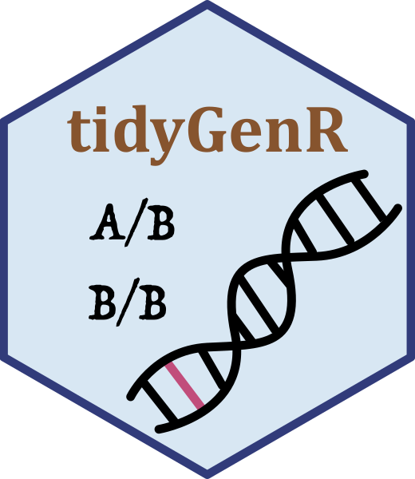

[](https://github.com/csmiguel/tidyGenR/actions/workflows/R-CMD-check.yaml)
[](https://codecov.io/gh/csmiguel/tidyGenR)
[](https://www.gnu.org/licenses/gpl-3.0)



# tidyGenR: Tidy multilocus amplicon genotypes in R

R package optimized for genotyping multilocus amplicon sequences from High Throughput Sequencing in diploid organism. Starting with FASTQ multilocus amplicon sequencing reads from high throughput sequencing, it demultiplexes reads by locus, call variants (using DADA2), and genotypes samples. It generates tidy variants and genotypes outputs, and it provides a family of functions for data manipulation and format conversion.

* optimized to genotype amplicon reads from diploid markers.
* FASTQ inputs: overlapping and non-overlapping, single-end or paired-end reads from Illumina.
* genotyping of one or multiple species simoultaneously
* various output format: tidy genotypes, FASTA, STRUCTURE, Genalex.

## Installation

```r
if (!requireNamespace("remotes", quietly = TRUE)) {
  install.packages("remotes")
}
remotes::install_github("csmiguel/tidyGenR")
```

# Workflow


